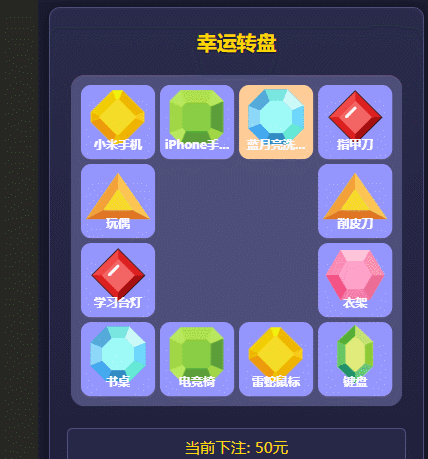

# Lucky Canvas 增强版 - 带经停动画的抽奖组件

基于 [Lucky Canvas](https://github.com/buuing/lucky-canvas) 二次开发，新增**经停动画**效果。

## 功能特性
- 完全兼容原版所有 API
- 新增可配置的经停动画
- 支持自定义经停时长
- 零成本迁移（仅需替换文件）

## 安装方式

### 文件替换法
1. 下载增强版 JS 文件
2. 替换原项目文件：
   ```bash
   cp lucky-canvas/packages/core/dist node_modules/lucky-canvas/dist/
   ```
3\. 重启开发服务器

## 使用方法

### 传统用法
```javascript
.stop(2);
```

### 增强用法
```javascript
.stop(2, {
  intermediateStop: true,   // 启用经停效果
  intermediateIndex: 1,    // 经停位置索引
  stopDelay: 1000          // 停留时长(ms)
});
```

## 参数说明

| 参数                | 类型    | 必填 | 默认值 | 说明               |
|---------------------|---------|------|--------|--------------------|
| intermediateStop    | Boolean | 是   | 无     | 是否启用经停效果   |
| intermediateIndex   | Number  | 是   | 无     | 经停位置的奖品索引 |
| stopDelay           | Number  | 否   | 800    | 经停时长(毫秒)     |

## 注意事项
1\) 必须指定 `intermediateIndex`  
2\) 替换文件后需**强制重启**开发工具  
3\) 经停索引应不同于最终索引

## 兼容性
- Vue 2/3  
- uniapp（已测试）  
- 原版 Lucky Canvas ≥ 2.4.0



## License
MIT
